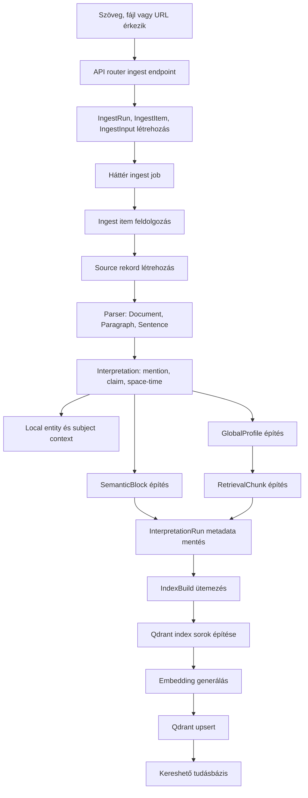
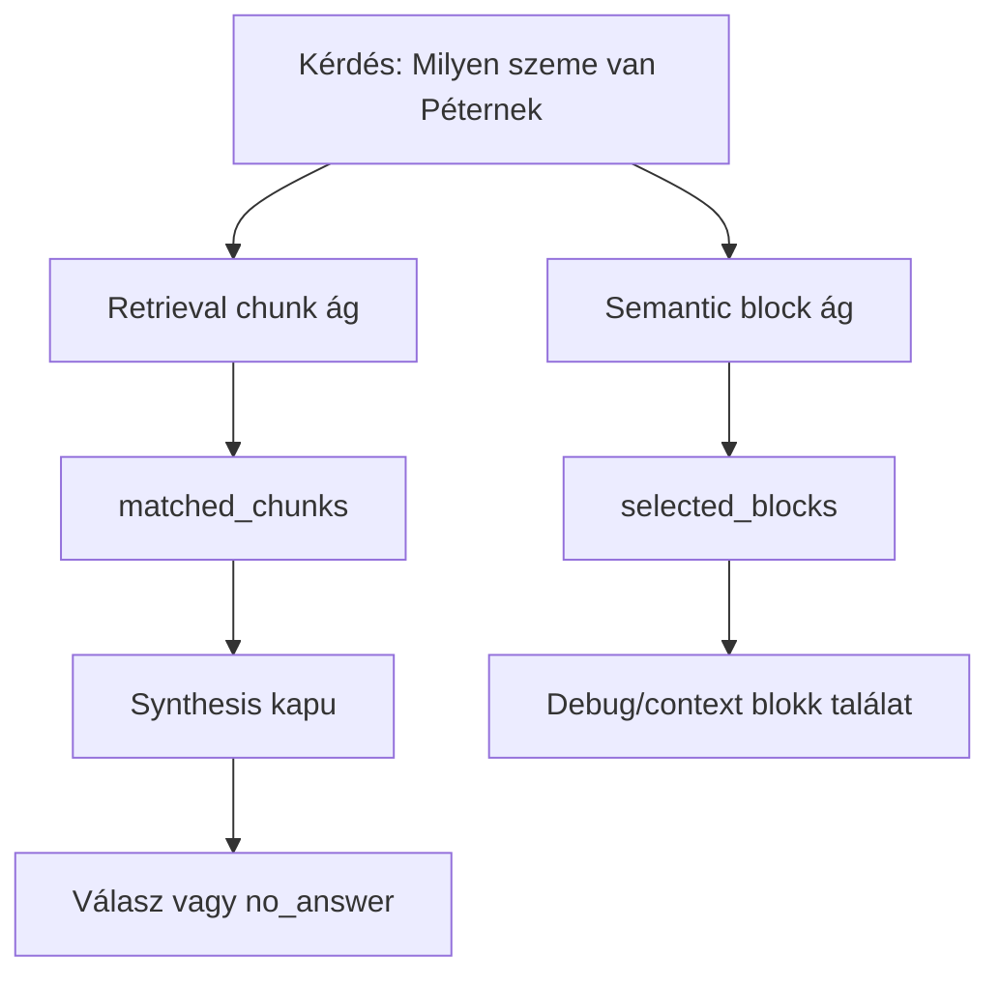

# Knowledge Tanítási Flow

Ez a dokumentum azt írja le, hogyan lesz egy feltöltött szövegből vagy fájlból kereshető tudás a knowledge modulban. A folyamat neve a kódban több helyen `ingest`, `parse`, `interpretation`, `index build` vagy `training` formában jelenik meg.

## Fő Flow

## 1. API Belépési Pontok

### `backend/apps/knowledge/api/router.py`

#### `create_text_ingest_run()`

Ez a szöveges tanítóanyag endpointja: `/knowledge/corpora/{corpus_uuid}/ingest/text`.

Feladata:

- Ellenőrzi, hogy a felhasználó hozzáférhet-e az adott corpushoz.
- Ellenőrzi a training/usage korlátokat.
- Átadja a szöveget a facade-nak.
- Elindítja a háttér ingest pipeline-t.

Következő lépés:

- `KnowledgeFacade.create_text_ingest_run()`
- `_enqueue_ingest_pipeline_job()`

#### `create_file_ingest_run()`

Ez a fájl upload endpointja: `/knowledge/corpora/{corpus_uuid}/ingest/files`.

Feladata:

- Feltöltött fájlok validálása.
- Upload policy, MIME, extension, méret és biztonsági feltételek ellenőrzése.
- A fájlok byte tartalmának átadása a facade-nak.
- A háttér ingest pipeline indítása.

Következő lépés:

- `KnowledgeFacade.create_file_ingest_run()`
- `_enqueue_ingest_pipeline_job()`

#### `create_url_ingest_run()`

URL alapú ingest endpoint: `/knowledge/corpora/{corpus_uuid}/ingest/urls`.

Feladata:

- URL ingest engedélyezettség és jogosultság ellenőrzése.
- URL inputok ingest runba szervezése.
- Háttér pipeline indítása.

Következő lépés:

- `KnowledgeFacade.create_url_ingest_run()`
- `_enqueue_ingest_pipeline_job()`

#### `_enqueue_ingest_pipeline_job()`

Feladata:

- Az ingest futást háttérbe teszi.
- Elsődlegesen platform outbox/event worker mechanizmust használ.
- Ha ez nem elérhető, FastAPI `BackgroundTasks` fallbacket használ.

Következő lépés:

- `process_ingest_run_and_start_index_async()`

## 2. Ingest Run Létrehozása

### `backend/apps/knowledge/service/knowledge_facade.py`

#### `create_text_ingest_run()`

Feladata:

- Létrehoz egy `IngestRun` rekordot.
- Létrehoz egy vagy több `IngestItem` rekordot.
- Létrehoz `IngestInput` rekordot `input_type="text"` értékkel.
- A nyers szöveg `text_content` mezőbe kerül.

Kimenet:

- Egy még nem feldolgozott ingest run, amit a háttér job fog végigvinni.

#### `create_file_ingest_run()`

Feladata:

- Létrehoz `IngestRun` és `IngestItem` rekordokat.
- A fájl byte tartalmát object storage-ba menti.
- Az `IngestInput` nem feltétlenül tartalmazza a teljes szöveget, hanem `object_key`, checksum és metadata alapján hivatkozik a fájlra.

Kimenet:

- Egy ingest run, amelynek itemjei fájl inputokra mutatnak.

#### `create_url_ingest_run()`

Feladata:

- URL típusú `IngestInput` rekordokat hoz létre.
- Az eredeti URL az input metadata/origin mezőiben marad meg.

## 3. Háttérfeldolgozás

### `backend/apps/knowledge/ingest_jobs.py`

#### `process_ingest_run_and_start_index_sync()`

Feladata:

- Tenant schema kontextusban futtatja a feldolgozást.
- Meghívja a facade `process_ingest_run()` metódusát.
- Sikeres ingest után index buildet ütemez.
- Majd elindítja az index buildet.

Következő lépés:

- `KnowledgeFacade.process_ingest_run()`
- `KnowledgeFacade.schedule_index_build()`
- `KnowledgeFacade.run_index_build()`

#### `process_ingest_run_and_start_index_async()`

Feladata:

- Async wrapper a fenti szinkron folyamat köré.
- A web requesttől leválasztva futtatja a tanítási folyamatot.

## 4. Ingest Item Feldolgozás

### `backend/apps/knowledge/service/knowledge_facade.py`

#### `process_ingest_run()`

Feladata:

- Betölti az ingest run itemjeit.
- Végigmegy minden itemen.
- Itemenként meghívja a feldolgozó metódust.
- Run státuszt és eseményeket frissít.

Következő lépés:

- `_process_single_ingest_item()`

#### `_process_single_ingest_item()`

Ez a tanítás első igazi tartalmi feldolgozó pontja.

Feladata:

- Betölti az `IngestInput` rekordot.
- Kinyeri az input típusát: text, file vagy url.
- Normalizálja és hash-eli a tartalmat.
- Duplikációt ellenőriz.
- Létrehoz vagy újrahasznosít egy `Source` rekordot.
- Elindítja a parser lépést.

Következő lépés:

- `parse_source()`

## 5. Source és Parser

### `backend/apps/knowledge/service/knowledge_facade.py`

#### `parse_source()`

Feladata:

- Parser run-t indít.
- A source-ból parser dokumentumot készít.
- Létrehozza és menti a dokumentum-szintű objektumokat:
  - `Document`
  - `Paragraph`
  - `Sentence`
- Parser metadata és státusz mezőket frissít.
- Elindítja az interpretation lépést.

Következő lépés:

- `_extract_parser_document_from_source()`
- `_interpret_document()`

#### `_extract_parser_document_from_source()`

Feladata input típus szerint:

- Text:
  - A raw text normalizálása.
  - Dokumentumszöveg előállítása.
- File:
  - Fájl byte-ok visszaolvasása object storage-ból.
  - Dokumentumszöveg kinyerése upload extractorral.
- URL:
  - URL tartalom előállítása és HTML/szöveg tisztítás.

Kimenet:

- Parser dokumentum, amelyből bekezdések és mondatok épülnek.

## 6. Interpretation: Tudás Kinyerése

### `backend/apps/knowledge/service/knowledge_facade.py`

#### `_interpret_document()`

Ez a tanítás központi metódusa. Itt lesz a dokumentumból strukturált tudás.

Feladata:

- Végigmegy a mondatokon.
- Mentionöket keres.
- Claim-eket nyer ki.
- Space-time információkat épít.
- Sentence interpretation rekordokat állít elő.
- Local entity és subject context információkat készít.
- Semantic blockokat épít.
- Global profile-okat épít.
- Retrieval chunkokat épít.
- Az interpretation eredményeket metadata és repository szinten menti.

Kimenet:

- Claim-ek.
- Sentence interpretationök.
- Mentionök.
- Space-time frame-ek.
- Semantic blockok.
- Global profile-ok.
- Retrieval chunkok.

## 7. Mondatból Claim

### `backend/apps/knowledge/service/claim_extraction_pipeline.py`

#### `run_v1_sentence_claim_pipeline()`

Ez mondatonként fut. Egy sentence-ből claim listát készít.

Lépései:

1. Sentence quality gate:
   - Eldönti, hogy a mondat egyáltalán alkalmas-e claim extractionre.
   - Kiszűrheti a zajt, kérdést, fragmentet.
2. Raw claim extraction:
   - `ClaimExtractorV1.extract_raw()` létrehozza a nyers subject/predicate/object claim jelölteket.
3. Sanitizer:
   - `sanitize_claim_candidates()` tisztítja a subject/object/predicate értékeket.
4. Claim quality gate:
   - `filter_claims_with_diagnostics()` kiszűri a gyenge vagy hibás claim-eket.
5. Negation jelölés:
   - Ha a mondat tagadást tartalmaz, a claim `assertion_mode="negation"` jelölést kap.

Kimenet:

- Elfogadott claim lista.
- Quality diagnosztika.

#### `sanitize_claim_candidates()`

Feladata:

- Subject normalizálás.
- Object normalizálás.
- Predicate normalizálás.
- Metadata jelölés, hogy sanitizer futott.

#### `detect_sentence_negation()`

Feladata:

- Magyar, angol és spanyol regex mintákkal tagadást keres.
- Példák: `nem`, `nincs`, `tilos`, `not`, `never`, `no`.

## 8. Semantic Block, Global Profile, Retrieval Chunk

### `backend/apps/knowledge/service/semantic_block_builder_v1.py`

#### `SemanticBlockBuilderV1.build()`

Feladata:

- Mondatokból és claim-ekből magasabb szintű blokkokat készít.
- Egy blokk több mondatot is összefoghat.
- Subject, tér/idő és témaváltási jelzések alapján határozza meg a blokkhatárokat.

Miért fontos:

- A későbbi retrievalben ez adja a `matched_semantic_blocks` / `selected_blocks` alapját.

### `backend/apps/knowledge/service/global_profile_builder_v0.py`

#### `GlobalProfileBuilderV0.build_many()`

Feladata:

- Claim-ekből entitás/profil szintű összefoglalót készít.
- Összerendezi az azonos entitáshoz tartozó állításokat.
- Előkészíti azt az anyagot, amelyből retrieval chunk épül.

### `backend/apps/knowledge/service/retrieval_chunk_builder_v0.py`

#### `RetrievalChunkBuilderV0.build_many()`

Feladata:

- Global profile-okból keresésre optimalizált chunkokat készít.
- Ezek tartalmazzák a strukturált fact payloadot és a retrievalhez használt szöveget.

Miért fontos:

- Kérdés-válaszkor a `QueryAwareRetrievalV0` ezekből állítja elő a `matched_chunks` listát.
- A synthesis alapvetően `matched_chunks` alapján dönt, hogy van-e elég strukturált bizonyíték a válaszhoz.

## 9. Index Build és Qdrant

### `backend/apps/knowledge/service/knowledge_facade.py`

#### `schedule_index_build()`

Feladata:

- Létrehoz egy `IndexBuild` rekordot.
- Meghatározza az index profile-t és Qdrant collection nevet.

Következő lépés:

- `run_index_build()`

#### `run_index_build()`

Feladata:

- Előkészíti a Qdrant collectiont.
- Betölti a source-okat és interpretation metadata-t.
- Qdrant index sorokat készít:
  - source/sentence/chunk jellegű sorok,
  - retrieval chunk sorok,
  - semantic block sorok.
- Meghívja a Qdrant wrapper upsert metódusait.
- Build státuszt frissít.

### `backend/apps/knowledge/service/retrieval_chunk_index_v0.py`

#### `build_retrieval_chunk_index_rows()`

Feladata:

- Retrieval chunk metadata alapján Qdrant payloadot készít.
- Beállítja a `point_type="retrieval_chunk"` jellegű adatokat.
- Olyan index sort állít elő, amelyből később vector vagy hybrid retrieval dolgozhat.

### `backend/apps/knowledge/service/semantic_block_index_v0.py`

#### `build_semantic_block_index_rows()`

Feladata:

- Semantic blockból Qdrant payloadot készít.
- Beállítja a block azonosítókat, source információt, subject/time/space mezőket és blokk szöveget.
- Ez adja később a `selected_blocks` debug sorok egyik fő forrását.

### `backend/apps/knowledge/qdrant/qdrant_wrapper.py`

#### `embed_text()`

Feladata:

- Egy szövegből embedding vektort készít a beállított providerrel.

#### `upsert_retrieval_chunk_points()`

Feladata:

- Retrieval chunk pontokat indexel Qdrantba.
- A pontok később a claim/profil alapú retrievalhez kellenek.

#### `upsert_semantic_block_points()`

Feladata:

- Semantic block pontokat indexel Qdrantba.
- A pontok később a blokk alapú retrievalhez és debug `selected_blocks` listához kapcsolódnak.

## 10. Kapcsolat a Kérdés-Válasz Folyamattal

Tanítás után két fontos anyag létezik:

- `retrieval_chunks`
  - Strukturált, claim/profil alapú keresési anyag.
  - Kérdéskor ebből lesz `matched_chunks`.
- `semantic_blocks`
  - Blokk/téma alapú keresési anyag.
  - Kérdéskor ebből lesz `matched_semantic_blocks`, illetve chat debugban `selected_blocks`.

A korábbi hiba szempontjából ez a lényeg:

Ha `selected_blocks` van, de `matched_chunks` üres, akkor a rendszer lát releváns blokkot, de a synthesis réteg nem kap strukturált bizonyíték-csomagot. Ilyenkor korábban `no_answer` lett az eredmény.

## 11. Tipikus Hibapontok

### Upload és ingest input

Ellenőrizendő:

- Létrejött-e `IngestRun`.
- Létrejött-e minden fájlhoz vagy szöveghez `IngestItem`.
- Létrejött-e `IngestInput`.
- Fájl esetén van-e `object_key`.
- Text esetén van-e `text_content`.

Ha itt bukik:

- A parserig sem jut el a tanítás.

### Source létrehozás

Ellenőrizendő:

- `_process_single_ingest_item()` létrehozott-e `Source` rekordot.
- A source kapcsolódik-e a corpushoz.
- A content hash nem duplikációként zárta-e le az itemet.

Ha itt bukik:

- Nem lesz parse run, document és sentence.

### Parser

Ellenőrizendő:

- `parse_source()` létrehozott-e `Document` rekordot.
- Vannak-e `Paragraph` és `Sentence` rekordok.
- Fájl esetén sikerült-e textet kinyerni.

Ha itt bukik:

- Nem lesz mondat, így claim extraction sem lesz.

### Claim extraction

Ellenőrizendő:

- `run_v1_sentence_claim_pipeline()` adott-e claim-eket.
- A sentence quality gate nem dobta-e ki a mondatot.
- A claim quality gate nem szűrte-e ki az összes claimet.
- Negation vagy sanitizer nem torzította-e a subject/object értékeket.

Ha itt bukik:

- Lehet semantic block szöveg, de kevés vagy nulla strukturált claim.

### Semantic block

Ellenőrizendő:

- `SemanticBlockBuilderV1.build()` adott-e blokkokat.
- A block tartalmaz-e `source_id`, `sentence_ids`, `claim_ids`, `text` vagy `summary` mezőket.
- A block státusza nem `rejected` vagy `withdrawn`.

Ha itt bukik:

- Kérdéskor nem lesz jó `selected_blocks` / `matched_semantic_blocks`.

### Retrieval chunk

Ellenőrizendő:

- `GlobalProfileBuilderV0.build_many()` épített-e profile-okat.
- `RetrievalChunkBuilderV0.build_many()` épített-e retrieval chunkokat.
- A retrieval chunk tartalmaz-e `source_ids`, `evidence_ids`, `profile_id`, `entity_name` mezőket.

Ha itt bukik:

- Kérdéskor `matched_chunks` üres lehet.
- A synthesis kapu `no_answer`-t adhat akkor is, ha semantic block találat van.

### Index build

Ellenőrizendő:

- `schedule_index_build()` létrehozta-e az index buildet.
- `run_index_build()` sikeresen lefutott-e.
- Qdrantba ment-e `retrieval_chunk` és `semantic_block` point is.
- Az embedding provider adott-e vektort.

Ha itt bukik:

- A tudás létezik DB/metadata szinten, de retrievalkor nem vagy csak részben található.

### Kérdés-válasz oldali tünet

Ha a debugban ez látszik:

- `selected_blocks`: nem üres
- `matched_chunks`: üres
- `retrieval_confidence`: 0

Akkor a valószínű ok:

- A semantic block ág működik.
- A retrieval chunk / query-aware chunk ág nem adott synthesis inputot.
- A válaszgenerálás nem kapott olyan bizonyíték-csomagot, amit `matched_chunks`-ként elfogad.

## 12. Gyors Diagnosztikai Checklist

Egy konkrét tanítási vagy válaszadási hiba vizsgálatánál ezt érdemes sorrendben nézni:

1. Ingest run:
   - Van-e sikeres `IngestRun`?
   - Minden item `completed`?
2. Parser:
   - Van-e `Document`?
   - Van-e legalább egy `Sentence`?
3. Interpretation:
   - Van-e claim?
   - Van-e semantic block?
   - Van-e retrieval chunk?
4. Index:
   - Lefutott-e `IndexBuild`?
   - Van-e Qdrant point `retrieval_chunk` típusban?
   - Van-e Qdrant point `semantic_block` típusban?
5. Retrieval debug:
   - `matched_chunks` üres vagy nem?
   - `selected_blocks` üres vagy nem?
   - `filtered_out_reason` mutat-e entity, state vagy answer type mismatch-et?

